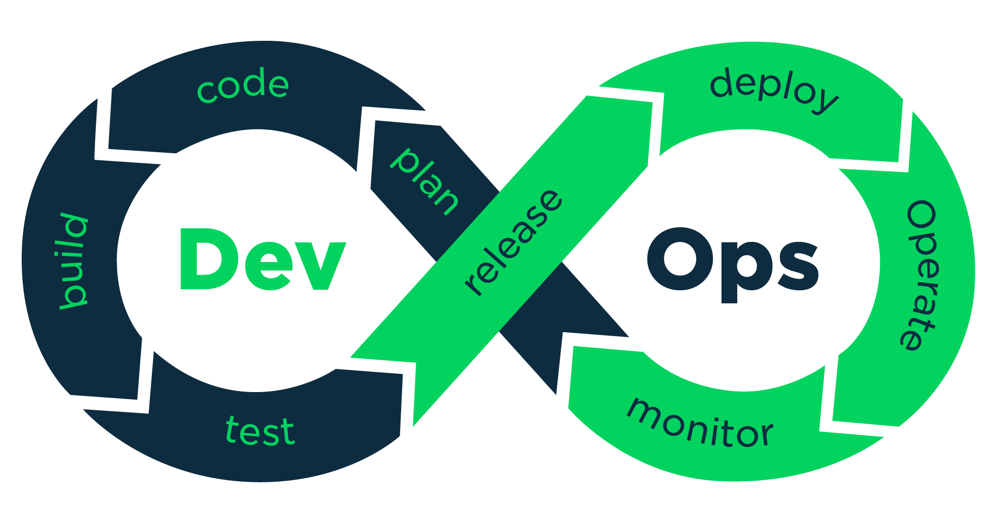

# DevOps-Roadmap

 

## Programing Language
- ### Python
  - Videos:
    - [Python Learning with Jadi on Youtube](https://www.youtube.com/watch?v=BR7m_2D_-Uw&list=PL-tKrPVkKKE1Y_o_h2w85dzVdoX5t7SI0) (Persian Language) (Free)
    - [Python Learning with Jadi on Aparat](https://www.aparat.com/v/Fk27n) (Persian Language) (Free)
  - Books/Docs/Code:
    - [Learn Python 3 the Hard Way](https://www.amazon.com/Learn-Python-Hard-Way-Introduction/dp/0134692888/ref=sr_1_1) (Includes projects to apply the knowledge)
    - [Effective Python: 90 Specific Ways to Write Better Python](https://www.amazon.com/Effective-Python-Specific-Software-Development/dp/0134853989/ref=sr_1_1) (Explains the Python best practices by using sample codes in different situations)
- ### Golang

## Step 0: Basic requirements
- ### Linux (LPIC-1)
  - Videos:
    - [LPIC-1: Linux Administrator (101-500 and 102-500)](https://app.pluralsight.com/paths/certificate/lpic-one) (You need to have pluralsight subscribtion to see this courses. This path is around 30 hours and it's so amazing) (English Language)
    - [LPIC-1 Learning with Jadi](https://www.aparat.com/v/vw7Gl?playlist=207575) (Persian Language)
  - Books/Docs/Code:
    - [Linux Command Line and Shell Scripting Bible 4th Edition](https://www.amazon.com/Linux-Command-Shell-Scripting-Bible/dp/1119700914/ref=pd_bxgy_img_sccl_2/145-7066057-4592848) (LPIC1-Level English book including shell scripting as well as Linux concepts)
- ### Docker
  - Videos:
    - [Docker for the Absolute Beginner](https://kodekloud.com/courses/docker-for-the-absolute-beginner/) (This course is free and it's a good start for learning docker )
  - Books/Docs/Code:
    - [Docker Deep Dive By  Nigel Poulton](https://www.amazon.com/Docker-Deep-Dive-Nigel-Poulton/dp/1521822808/ref=tmm_pap_swatch_0) (English book for beginners to have a fundamental knowledge of how to use Docker)

- ### Bash-Script
  - Books/Docs/Code:
    - [Bash Script Tutorial](https://github.com/ahmadalibagheri/bash-script-tutorial) (Sample Traning Code)

- ### Git
  - Videos:
    - [Git Learning with Jadi](https://faradars.org/courses/fvgit9609-git-github-gitlab) (Persian Language) (Free)
    - [Git Learning with Roocket](https://roocket.ir/series/learn-git-and-github) (Persian Language) (Free) 
    - [Git Learning with Mosh](https://codewithmosh.com/p/the-ultimate-git-course) (English Language) (Free)
  - Books/Docs/Code:
    - [Ry's Git Tutorial](https://www.amazon.com/Rys-Git-Tutorial-Ryan-Hodson-ebook/dp/B00QFIA5OC/ref=sr_1_15) (English book for all grades)

## Step 1: IaC (Infrastructure as Code)
- ### Hashicorp Terraform (Strongly Recommended)
    - [Terraform Tutorial](https://github.com/ahmadalibagheri/terraform-tutorial) (Sample Traning Code from non public cloud provider)
- ### Pulumi (Normal)

## Step 2: Configuration Managment
- ### Ansible (Strongly Recommended)
  - Books/Docs/Code:
    - [Ansible Tutorial](https://github.com/ahmadalibagheri/Ansible-tutorial) (Sample Traning Code)
    - [Ansible: From Beginner to Pro](https://www.amazon.com/Ansible-Beginner-Pro-Michael-Heap/dp/1484216601/ref=sr_1_19) (Beginner Book)
    - [Ansible for DevOps](https://www.amazon.com/Ansible-DevOps-Server-configuration-management/dp/0986393428/ref=sr_1_4) (Advanced Book)
- ### Puppet (Important)
- ### SaltStack (Normal)
- ### Chef (Normal)

### Step 2.5: End-to-End Automation
on this step you need to learning End-to-End automation with Ansible and Terraform on infrastruture. Please follow bottom repos.
- #### End-to-End Automation on VMware vsphere with Ansible and Terraform
  - Books/Docs/Code:
    - [Terraform vsphere Ansible Tutorial](https://github.com/ahmadalibagheri/terraform-vsphere-ansible) (Sample Training Code)
- #### Build all instance images with Hashicorp Packer
  - Books/Docs/Code:
    - [Packer Tutorial](https://github.com/ahmadalibagheri/packer-tutorial)

## Step 3: CI/CD (Continuous Integration and Continuous Delivery)
- ### Jenkins (Suitable for CI and CD in ALl infrastructure)(Free) (Strongly Recommended)
    - [Jenkins Tutorial](https://github.com/ahmadalibagheri/jenkins-tutorial) (Sample Traning Code)
- ### CircleCI (Paid)(Important)
- ### Teamcity (Paid)
- ### Bamboo (Paid)
- ### GitLab (Suitable for CI and CD in ALl infrastructure)(Paid)
  - Books/Docs/Code:
    - [Mastering GitLab 12: Implement DevOps culture and repository management solutions](https://www.amazon.com/Mastering-GitLab-Implement-repository-management-ebook/dp/B07W6F6SGG/ref=sr_1_3) (Beginner-To-Advanced English book to get familiar with GitLab and its scenarios as the real-world examples explain.)
- ### Azure DevOps (Suitable for CI and CD in Windows infrastructure)(Paid)

## Step 4: Containerization
- ### Kubernetes
  - Videos:
    - [Kubernetes Tutorial for Beginners [FULL COURSE in 4 Hours]](https://www.youtube.com/watch?v=X48VuDVv0do) (It's a great start to learn what is kubernetes)(Free)
    - [Certified Kubernetes Administrator (CKA)](https://www.udemy.com/course/certified-kubernetes-administrator-with-practice-tests/) (Kubernetes Administration course by Mumshad, also has a free lab on kodekloud for anyone who bought the course from udemy)(Paid)
  - Books/Docs/Code:
    - [Kubernetes Complete Reference](https://github.com/ahmadalibagheri/kubernetes-complete-reference) (Sample Traning Code)

- ### Helm (Kubernetes Package manager)

### Step 4.5: GitOps Implementation
- #### GitOps
  - Books/Docs/Code:
    - [Jenkins-X](https://jenkins-x.io/) (CI/CD) (Free)
    - [ArgoCD](https://argo-cd.readthedocs.io/en/stable/) (CD) (free)
    - [Spinnaker](https://spinnaker.io/) (CD) (free)

## Step 5: Monitoring and Logging
- ### Prometheous + Grafana (Free)
  - Books/Docs/Code:
    - [Prometheus: Up & Running: Infrastructure and Application Performance Monitoring](https://www.amazon.com/Prometheus-Infrastructure-Application-Performance-Monitoring/dp/1492034142/ref=sr_1_1) (English Book)
- ### Telegraf + InfluxDB + Grafana (Free)
- ### Datadog (Paid)
- ### ELK Stack (Free)
  - Videos:
    - [Complete Guide to Elasticsearch](https://www.udemy.com/course/elasticsearch-complete-guide/) (To learn elasticsearch itself)
    - [Data Visualization with Kibana](https://www.udemy.com/course/data-visualization-with-kibana/) (To learn the visualizations with Kibana)
    - [Data Processing with Logstash (and Filebeat](https://www.udemy.com/course/processing-events-with-logstash/) (To learn the pipeline design and implementation using Logstash)
